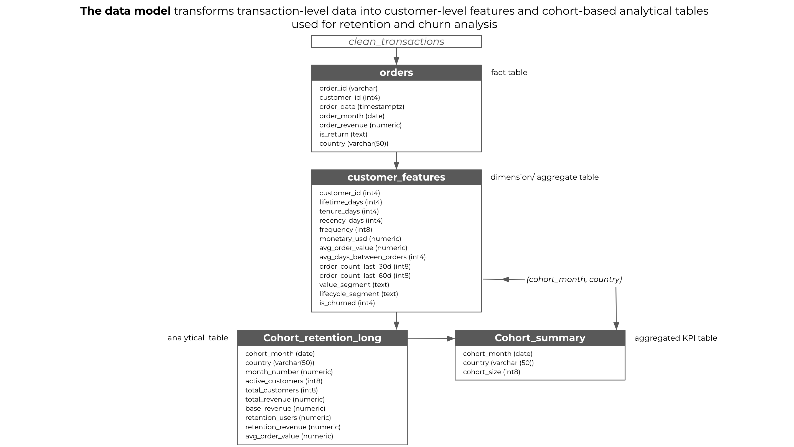
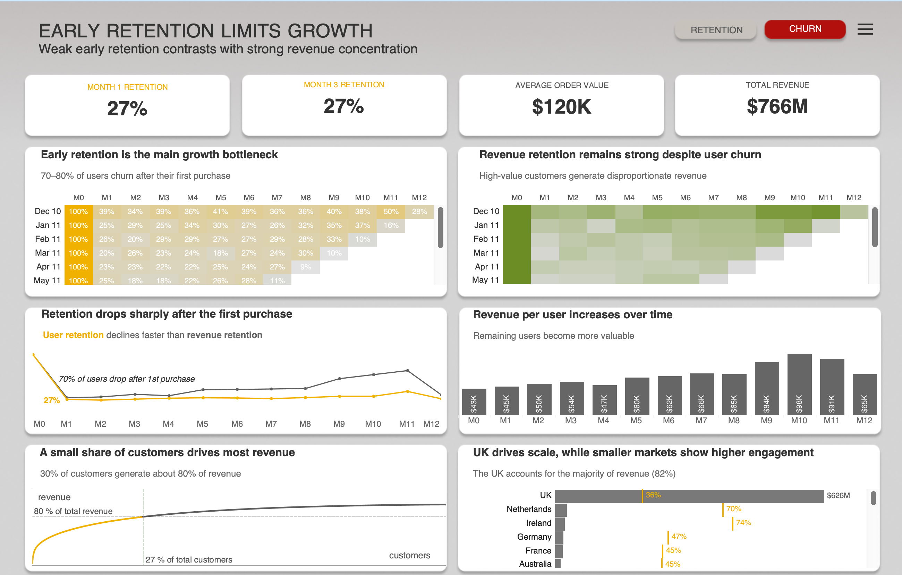
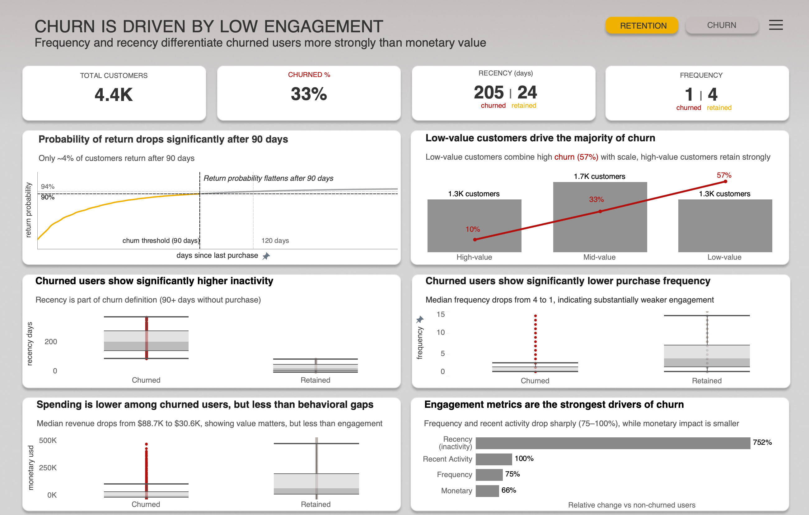

# `Grayford Supply` | Diagnosing Churn Drivers and Retention Opportunities

---

## I. Project Background

**Grayford Supply** is a UK-based B2B wholesale platform that supplies products to small and medium-sized businesses globally.

The company operates across **30+ countries**, with a strong concentration of revenue in the UK market. Customers place **relatively infrequent but high-value orders**, making **retention and repeat purchases critical** for sustainable growth.

The platform functions as a centralized procurement hub, where retailers and distributors source products across multiple categories.

### Key Business Question

**Why do customers churn, and what behavioral patterns differentiate retained vs churned users?**

---

## Scope of Analysis

The analysis focuses on three core business dimensions:

### Customer Retention
- Cohort analysis  
- Retention curves  
- Early lifecycle drop-off  

### Revenue Dynamics
- Revenue retention vs user retention  
- Revenue concentration (**Pareto analysis**)  
- Customer value distribution  

### Churn Drivers
- Behavioral differences (**recency, frequency, activity**)  
- Segment-level churn  
- Return probability and churn threshold  

---

## II. Data Structure & Validation

The dataset includes **500,000+ transactions** and is structured at a **transaction (line-item) level**, not order-level.

This enables **detailed behavioral analysis** but requires aggregation to derive **customer-level insights**.

---

## Data Preparation Workflow

The project follows a **full ETL pipeline** to simulate a production-level analytical workflow:

### Python (Pandas)
- Data cleaning and preprocessing  
- Handling missing values and outliers  
- Feature engineering (**RFM metrics, behavioral features**)  
- Exploratory analysis and **churn threshold validation**  

### PostgreSQL
- Transformation of raw data into analytical tables:
  - `orders`  
  - `customer_features`  
  - `cohort_retention_long`  
  - `cohort_summary`  
- Creation of **reusable views for BI tools**  
- Cohort and retention calculations  

### Tableau
- Dashboard development  
- Metric validation and business logic alignment  
- Data storytelling and visualization  

---

## III. Executive Summary

### Tableau Dashboard

The analysis is presented through two complementary dashboards:

- **Retention Analysis Dashboard**  
- **Churn Drivers Dashboard**  

Together, they provide a **full view of the customer lifecycle — from acquisition to churn**.

👆 Click the [Tableau Public dashboard](https://surl.lt/zkpjkm) to explore interactive filters and drill-downs.

---

> ## Business Impact
>
> The analysis reveals a **structural retention challenge**:
>
> - The **majority of users churn early** in their lifecycle  
> - Revenue is **highly concentrated among a small segment** of retained customers  
> - **Customer engagement — not just monetary value — is the primary driver of retention**  
>
> This creates a **dependency on a limited group of high-value users**, increasing **long-term business risk**.

---

## Key Findings

### Early Retention Drop
- **70–80% of users churn after the first purchase**  
- Retention stabilizes after the initial drop, indicating a **critical early lifecycle bottleneck**  

### Revenue vs User Retention Gap
- Revenue retention declines **significantly slower** than user retention  
- A **small share of users generates the majority of revenue**  

### Revenue Concentration (Pareto)
- **~30% of customers generate ~80% of total revenue**  
- The business deviates from the classic **80/20 rule**, but remains **highly concentrated**  

### Churn Distribution
- **~33% of customers are churned**  
- Churn is **not evenly distributed across segments**  

### Segment-Level Insight
- **Low-value customers drive the majority of churn**  
  - due to **high churn rate (~57%)**  
  - and **large segment size**  
- **High-value customers show strong retention (~10% churn)**  

### Behavioral Drivers of Churn

Churn is primarily driven by **declining engagement**:

- **Recency → significantly higher inactivity**  
- **Frequency → drops from median 4 → 1**  
- **Recent activity → near zero in last 30–60 days**  

### Return Probability
- Probability of return drops sharply after **90 days of inactivity**  
- Only **~4% of users return after this threshold**  

---

## Strategic Interpretation

Churn is **not a sudden event** — it is a **gradual decline in customer engagement**.

The most important signals are **behavioral**:

- inactivity  
- declining purchase frequency  
- lack of recent interaction  

**Monetary value plays a role, but is secondary compared to engagement.**

---

## Strategic Insights

- **Retention is driven by behavior, not just customer value**  
- **Early lifecycle engagement is the most critical stage**  
- **High-value customers represent a disproportionate share of revenue**  
- **Churn risk can be identified early through behavioral signals**  

---

## IV. Strategic Recommendations

### 1. Improve Early Retention (Critical Priority)
- Focus on the **first 30–60 days** after initial purchase  
- Introduce **onboarding and engagement flows** for new customers  
- Stimulate the **second purchase**  

### 2. Monitor Inactivity Signals
- Track customer inactivity between **30–90 days**  
- Trigger **re-engagement campaigns before churn threshold**  
- Use **behavioral alerts** (low frequency, declining activity)  

### 3. Protect High-Value Customers
- Identify and prioritize **high-value segments**  
- Develop retention programs (**loyalty, account management**)  
- Reduce churn risk among **top revenue contributors**  

### 4. Shift Focus from Acquisition to Retention Quality
- Optimize not just for **new customers**, but for **repeat behavior**  
- Measure success through **retention and customer lifetime value**  

### 5. Next Step: Predictive Modeling
- Build **churn prediction models using behavioral features**  
- Enable **proactive retention strategies at the individual level**  

---
 

*Technical summary of tools and analytical methods used in this project*:
- Tools: Python (Pandas), Jupyter Notebook, SQL, Tableau  
- Analytical Techniques: Data cleaning & preprocessing, Exploratory Data Analysis (EDA), Cohort analysis & retention, curves, Churn definition using behavioral thresholds, Feature engineering (RFM & behavioral features), Customer segmentation, Data validation & metric reconciliation, Dashboard design & data storytelling
- Key Metrics: Customer Retention Rate, Churn Rate, Cohort Retention (%), Revenue Retention vs User Retention, Monetary, Purchase Frequency, Days Between Orders, Recency, Average Order Value (AOV), Revenue Concentration (Pareto distribution), Return Probability 